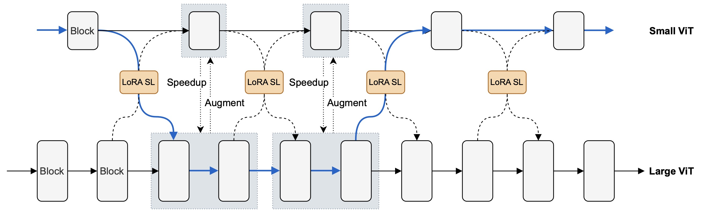
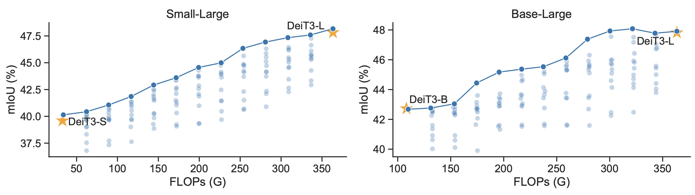
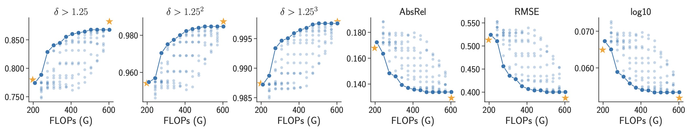
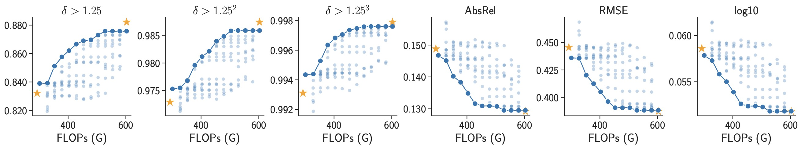

# Stitched ViTs are Flexible Vision Backbones

This is the official PyTorch implementation for [Stitched ViTs are Flexible Vision Backbones](https://arxiv.org/abs/xxx).

By [Zizheng Pan](https://scholar.google.com.au/citations?user=w_VMopoAAAAJ&hl=en), [Jing Liu](https://scholar.google.com.au/citations?user=-lHaZH4AAAAJ), [Haoyu He](https://scholar.google.com/citations?user=aU1zMhUAAAAJ&hl=en),  [Jianfei Cai](https://scholar.google.com/citations?user=N6czCoUAAAAJ&hl=en), and [Bohan Zhuang](https://scholar.google.com.au/citations?user=DFuDBBwAAAAJ).

Code will be released soon.

## Results

**Understand the figures:**

- Each point represents for a stitch in SN-Net, which can be **instantly selected** at runtime without additional training cost.
- SN-Netv2 can produces **10x more** stitches than SN-Netv1. For better comparison, we highlight the Pareto frontier in SN-Netv2. 
- **The yellow star** represents for adopting an individual ViT as backbone for downstream task adaptation.
- All models are trained under the same training iterations/epochs.

### Image Classification on ImageNet-1K

### Semantic Segmentation on ADE20K and COCO-Stuff-10K

<figure>
    
  
 <figcaption>ADE20K results based on SETR.</figcaption>

</figure>

<figure>
    
  
 <figcaption>COCO-Stuff-10K results based on SETR.</figcaption>

</figure>

### Depth Estimation on NYUv2

<figure>
    
  
 <figcaption>Stitching DeiT3-S and DeiT3-L based on DPT.</figcaption>

</figure>

<figure>
    
  
 <figcaption>Stitching DeiT3-B and DeiT3-L based on DPT.</figcaption>

</figure>

### Object Detection and Instance Segmentation on COCO-2017

<figure>
    
  
 <figcaption>Stitching DeiT3-S and DeiT3-L based on Mask R-CNN/ViTDet.</figcaption>

</figure>

## License

This repository is released under the Apache 2.0 license as found in the [LICENSE](https://github.com/ziplab/SN-Netv2/blob/main/LICENSE) file.
