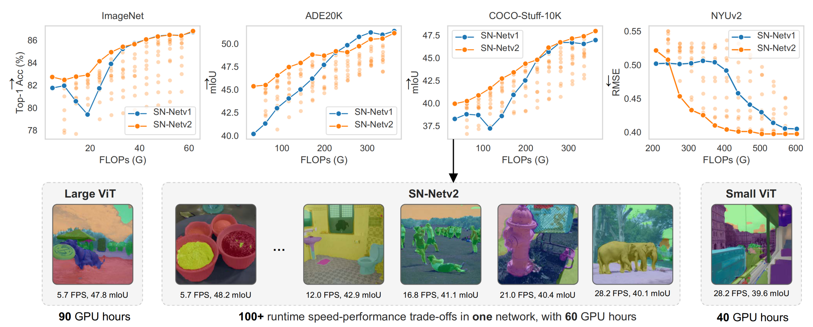
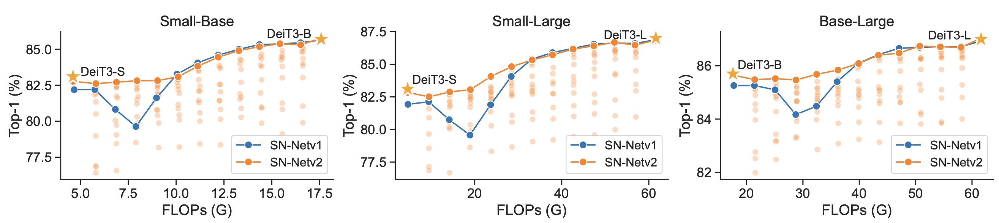
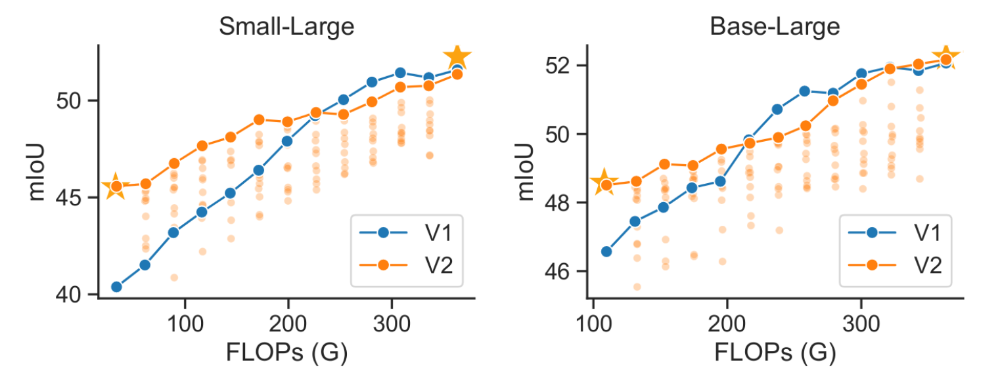
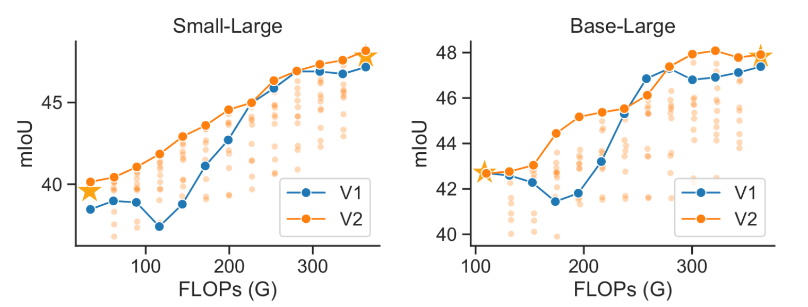
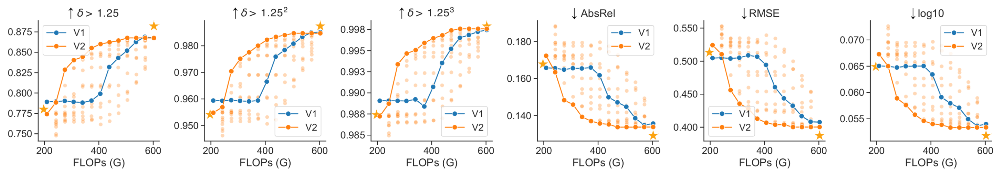
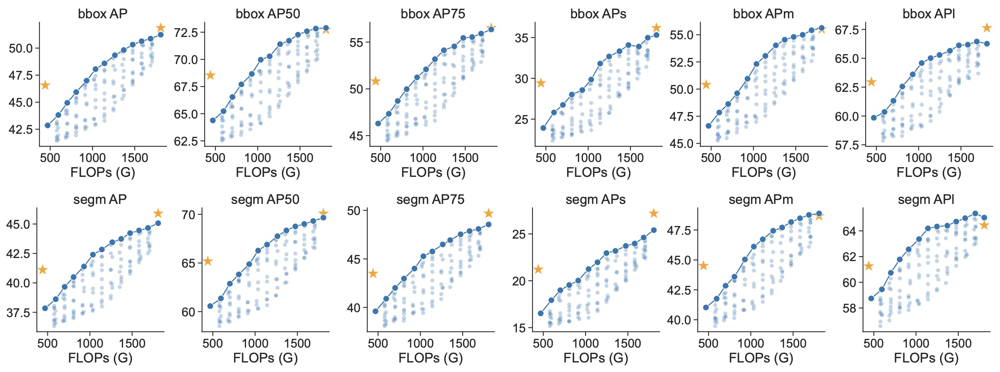
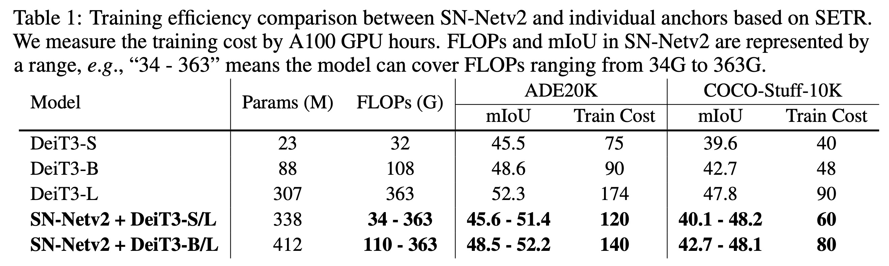

# Stitched ViTs are Flexible Vision Backbones

This is the official PyTorch implementation for [Stitched ViTs are Flexible Vision Backbones](https://arxiv.org/abs/2307.00154).

By [Zizheng Pan](https://scholar.google.com.au/citations?user=w_VMopoAAAAJ&hl=en), [Jing Liu](https://scholar.google.com.au/citations?user=-lHaZH4AAAAJ), [Haoyu He](https://scholar.google.com/citations?user=aU1zMhUAAAAJ&hl=en),  [Jianfei Cai](https://scholar.google.com/citations?user=N6czCoUAAAAJ&hl=en), and [Bohan Zhuang](https://scholar.google.com.au/citations?user=DFuDBBwAAAAJ).



We adapt the framework of stitchable neural networks (SN-Net) into downstream dense prediction tasks. Compared to SNNetv1, the new framework consistently improves the performance at low FLOPs while maintaining competitive performance at high FLOPs across different datasets, thus obtaining a better Pareto frontier (highlighted in lines).


## 📰 News

- 13/01/2024. Release code on ImageNet-1K classification 🔥. The classification code is an easy way to start understanding how SN-Netv2 works and how it differs from V1.


## Getting Started

For image classification on ImageNet-1K, please refer to [classification](https://github.com/ziplab/SN-Netv2/tree/main/classification).


## ✨ Results

**Understand the figures:**

- Each point represents for a stitch in SN-Net, which can be **instantly selected** at runtime without additional training cost.
- SN-Netv2 can produces **10x more** stitches than SN-Netv1. For better comparison, we highlight the Pareto frontier in SN-Netv2. 
- **The yellow star** represents for adopting an individual ViT as backbone for downstream task adaptation.
- All models are trained under the same training iterations/epochs.


### Image Classification on ImageNet-1K




### Semantic Segmentation on ADE20K and COCO-Stuff-10K

ADE20K             |  COCO-Stuff-10K
:-------------------------:|:-------------------------:
  |  


### Depth Estimation on NYUv2

<figure>
  <center> <figcaption>Stitching DeiT3-S and DeiT3-L based on DPT.</figcaption></center>
  
</figure>


### Object Detection and Instance Segmentation on COCO-2017


<figure>
  <center> <figcaption>Stitching DeiT3-S and DeiT3-L based on Mask R-CNN/ViTDet.</figcaption></center>
  
</figure>


### Training Efficiency Comparison




## 🚧 TODO List

- [x] Classification code

- [ ] Segmentation code

- [ ] Depth estimation code

- [ ] Detection code

- [ ] Gradio demo


## ✍ Citation

If you use SN-Netv2 in your research, please consider the following BibTeX entry and giving us a star 🌟.

```BibTeX
@article{pan2023snnetv2,
  title={Stitched ViTs are Flexible Vision Backbones},
  author={Pan, Zizheng and Liu, Jing and He, Haoyu and Cai, Jianfei and Zhuang, Bohan},
  journal={arXiv},
  year={2023}
}
```

If you find the code useful, please also consider the following BibTeX entry

```BibTeX
@inproceedings{pan2023snnetv1,
  title     = {Stitchable Neural Networks},
  author    = {Pan, Zizheng and Cai, Jianfei and Zhuang, Bohan},
  booktitle = {CVPR},
  year      = {2023},
}
```


## License

This repository is released under the Apache 2.0 license as found in the [LICENSE](https://github.com/ziplab/SN-Netv2/blob/main/LICENSE) file.
